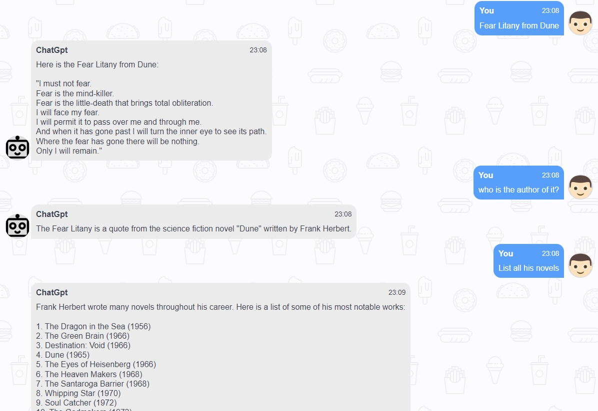

# ChatGPT Web Demo

A web based chat box by using ChatGPT API.

The web framework uses [Volt Dashboard Flask](https://appseed.us/product/volt-dashboard/flask/). Please check source code on [flask-volt-dashboard](https://github.com/app-generator/flask-volt-dashboard).

Chat box html template and css style is borrowed from [studygyaan.com](https://studygyaan.com/python/create-web-based-chatbot-in-python-django-flask) by [H Sayyed](https://studygyaan.com/author/huzaif-sayedgmail-com).

- 👉 For using `text-davinci-003`, check [chatGptDavinci.py](apps/chat/chatGptDavinci.py)
- 👉 For using `gpt-3.5-turbo`, check [chatGptTurbo.py](apps/chat/chatGptTurbo.py)
- 👉 Using this app needs user log in. To enable new user register, comment out "register" block in file [login.html](apps/templates/accounts/login.html)
- 👉 When dubugging on frontend/backend connetivity and other UI related stuff, set `FAKE_CHAT = True` in [chatGptDavinci.py](apps/chat/chatGptDavinci.py) or [chatGptTurbo.py](apps/chat/chatGptTurbo.py), this will gernerate some ramdon string as response instead of using ChatGPT API, to save API calling charged by OpenAI.

# Running app

### Setup

Check [host.and.docker.dual.mode.md](host.and.docker.dual.mode.md)

### To run app in docker:

```bash
$ docker-compose up --build (first time running)
```

Or

```bash
$ docker-compose up
```

### To run app in local host:

```bash
(first activate python virturalenv)
$ flask run -p port_num -h host_ip
```



